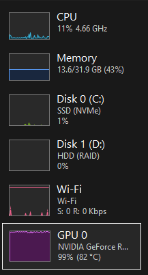
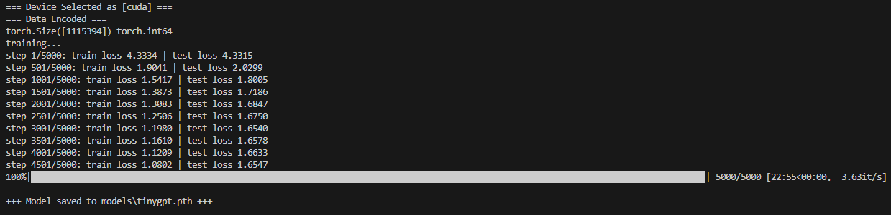

# SMOLL Language Model

[](https://pytorch.org/)
[](https://developer.nvidia.com/cuda-toolkit)

A lightweight implementation of language models built from scratch using pytorch, featuring both a Bigram model and a TinyGPT-like model for character-level text generation.

## Project Overview

This project demonstrates the fundamentals of language modeling by implementing two different architectures:

### Models

The `models.py` file contains two distinct models:

1. **Bigram Model** - A simple baseline model that predicts the next character based solely on the previous character
2. **TinyGPT Model** - A transformer-based model built from scratch with self-attention mechanisms, inspired by GPT architecture

Both models are trained to generate Shakespeare-like text using the Tiny Shakespeare dataset.

## Training Details

### Hardware & Performance

- **GPU**: NVIDIA RTX 3070
- **Training Time**: ~20 minutes with the current configuration
- **GPU Utilization**: Maxes out GPU resources during training

The training process is computationally intensive and fully utilizes the GPU as shown below:



### Training Loop

Below is an example screenshot of the training process in action:



## Configuration

Training parameters can be customized in `config.py`. Default settings include:
- Context size: 256
- Batch size: 64
- Embedding dimension: 384
- Number of heads: 6
- Number of layers: 6
- Learning rate: 3e-4
- Total epochs: 5000

## Usage

### Training the Model

```bash
python train.py
```

### Testing/Playing with the Model

```bash
python play.py
```

## Project Structure

```
├── models.py              # Bigram and TinyGPT model implementations
├── train.py              # Training script
├── play.py               # Inference/generation script
├── config.py             # Configuration parameters
├── utils.py              # Utility functions
├── dataset/              # Dataset directory
│   └── tinyshakespeare.txt
├── models/               # Trained model weights
│   ├── tinygpt.pth
│   └── model_weights.pth
├── catalog/              # Additional resources
└── requirements.txt      # Dependencies
```

## Resources

This project was built following the excellent educational resource by Andrej Karpathy:

- **[Let's build GPT](https://youtu.be/kCc8FmEb1nY?si=G4RerujQh8_rB5gD)** - Highly recommended for understanding the fundamentals of building language models from scratch

Key research papers referenced in this project:

- **[Attention Is All You Need](https://arxiv.org/abs/1706.03762)** - The foundational transformer paper that introduced the self-attention mechanism used in the TinyGPT model

## Requirements

Install dependencies using:

```bash
pip install -r requirements.txt
```

For CUDA 13 support, use:

```bash
pip install -r cuda13_requirements.txt
```

## License

This project is licensed under the MIT License - see the LICENSE file for details.

---

**Note**: This is an educational and demonstration project designed for learning purposes. It showcases core concepts in language modeling and transformer architectures, making it ideal for students and practitioners looking to understand how modern language models work from the ground up.
